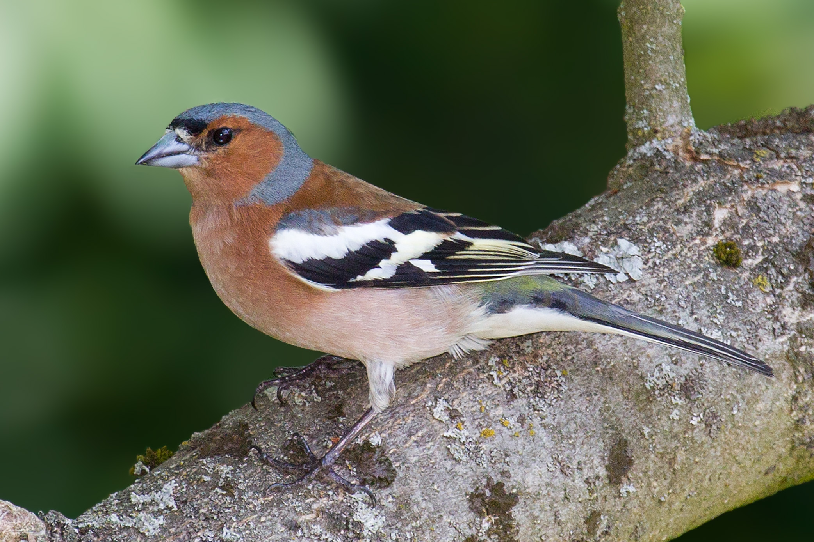

```{r setup, include=FALSE}
knitr::opts_chunk$set(echo = FALSE, warning = FALSE,
                      message = FALSE, fig.retina = 3)
```

```{r packages}
library(tidyverse)
```
# Introduction

The chaffinch is one of the most widespread and abundant bird in Britain and Ireland, [@noauthor_undated-bz].
Monitoring of the phenotype of species is important for the species and can give indication changes in phenotypic plasticity or genetic variation, [@Blackburn2013-wv].

This data looks at the differences in mass between the male chaffinch, \@ref(fig:male-chaffinch-figure) and the female chaffinch, \@ref(fig:female-chaffinch-figure). 

<!-- figure legend -->
(ref:male-chaffinch) Male Chaffinch, By Andreas Trepte - Own work, CC BY-SA 2.5, https://commons.wikimedia.org/w/index.php?curid=15264293
<!-- end of figure legend -->

```{r male-chaffinch-figure, fig.cap= '(ref:male-chaffinch)', out.width="50%"}

```
```{r female-chaffinch-figure, fig.cap="Female Chaffinch, By 4028mdk09 - Own work, CC BY-SA 3.0, https://commons.wikimedia.org/w/index.php?curid=20640633", out.width="50%"}
knitr::include_graphics("images/Fulda_Buchfinkweibchen_Juni_2012.jpeg")
```

# Methods

Importing and summarising the data from chaff.txt. 

```{r importing data}
# reading in the chaff.txt data
chaff <- read.table("data-raw/chaff.txt", header = TRUE)
```

```{r tidying data}
# reformatting the data into tidy format and writing to file
tidy_chaff <- chaff %>%
  pivot_longer(names_to = "sex", 
               values_to = "mass",
               cols = everything())

file <-  "data/tidy_chaff.txt"
write.table(tidy_chaff, 
            file, 
            quote = FALSE,
            row.names = FALSE)
```

```{r sum_sq function, results='hide'}

sum_sq <- function(df, measure, group) {
  df %>% group_by({{ group }}) %>% 
    summarise(ss = sum(({{measure}} - mean({{measure}}))^2))
}

sum_sq(tidy_chaff, mass, sex)

```
# Results

```{r summary function}

data_summary <- function(df, measure, group) {
  df %>% group_by({{ group }}) %>%
    summarise(mean = mean(({{measure}})),
              n = length(({{measure}})),
              sd = sd(({{measure}})),
              se = sd(({{measure}} / length({{measure}}))))
}

summarised_chaff <- data_summary(tidy_chaff, mass, sex)
summarised_chaff
```

```{r statistical analysis}

stat_analysis <- aov(tidy_chaff$mass ~ tidy_chaff$sex)

summary(stat_analysis)

TukeyHSD(stat_analysis)
```

```{r visualising results, fig.cap="Mean mass of male and female chaffinches"}
source("themes/theme_sophie.R")
plot1 <- ggplot(tidy_chaff, aes(x= sex, y=mass)) +
  geom_boxplot() + 
  theme_sophie() +
  ylab("Mass") +
  xlab("Sex") +
  annotate("segment", x = 1, xend = 2, y= 30, yend = 30) +
  annotate("segment", x = 1, xend = 1, y = 29, yend = 30) +
  annotate("segment", x = 2, xend = 2, y = 29, yend = 30) +
  annotate("text", x = 1.5, y = 31, label = "*", size = 8)

plot1
```

# Discussion

# References
